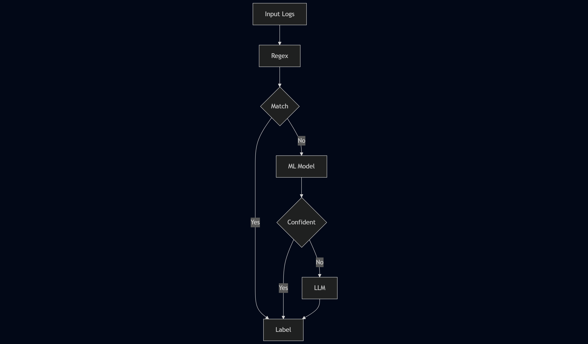

# Hybrid Cascade Log Classifier

This project implements a hybrid cascade log classification system that applies multiple classification techniques in a sequential manner to handle varying levels of complexity in log patterns. Each stage in the cascade is designed to efficiently process predictable, complex, and weakly labeled log data, ensuring both accuracy and adaptability across diverse logging scenarios.




---

## Classification Approaches

1. **Regular Expression (Regex)**:
   - Handles simple and deterministic log patterns.
   - Suitable for scenarios where rules can be explicitly defined.

2. **Sentence Transformer + Logistic Regression**:
   - Processes complex log patterns when sufficient labeled data is available.
   - Generates semantic embeddings using Sentence Transformers and applies Logistic Regression for classification.

3. **LLM (Large Language Models)**:
   - Used for complex log patterns when labeled training data is limited or unavailable.
   - Acts as a fallback or complementary layer to the other classification approaches.


---

## Folder Structure

1. **`training/`**:
   - Contains the code for training models using Sentence Transformer and Logistic Regression.
   - Includes the code for regex-based classification.

2. **`models/`**:
   - Stores the saved models, including Sentence Transformer embeddings and the Logistic Regression model.

3. **`resources/`**:
   - This folder contains resource files such as test CSV files, output files, images, etc.

4. **Root Directory**:
   - Contains the FastAPI server code (`server.py`).

---

## Setup Instructions

1. **Install Dependencies**:
   Make sure you have Python installed on your system. Install the required Python libraries by running the following command:

   ```bash
   pip install -r requirements.txt
   ```

2. **Run the FastAPI Server**:
   To start the server, use the following command:

   ```bash
   uvicorn server:app --reload
   ```

   Once the server is running, you can access the API at:
   - `http://127.0.0.1:8000/` (Main endpoint)
   - `http://127.0.0.1:8000/docs` (Interactive Swagger documentation)
   - `http://127.0.0.1:8000/redoc` (Alternative API documentation)

---

## Usage

Upload a CSV file containing logs to the FastAPI endpoint for classification. Ensure the file has the following columns:
- `source`
- `log_message`

The output will be a CSV file with an additional column `target_label`, which represents the classified label for each log entry.

---

**Credits and Acknowledgment**  

This project was created as part of a learning initiative inspired by  
@Codebasics Inc and @LearnerX Pvt Ltd.

Special thanks to the original creator and instructors for their educational content.
